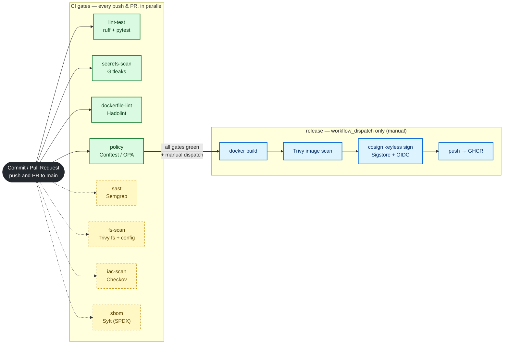

# DevSecOps Reference Pipeline

[](.github/workflows/devsecops.yml)
[](LICENSE)
[](app/requirements.txt)

A complete, **green-on-a-public-fork** DevSecOps CI/CD pipeline that scans a small
but real sample service. It demonstrates shift-left security: secrets scanning,
SAST, dependency/container vulnerability scanning, IaC misconfiguration scanning,
policy-as-code gates, SBOM generation, and keyless image signing — wired into a
single GitHub Actions workflow with least-privilege permissions.

> **Author:** Md Irshad — Senior Cloud & AI Platform Engineer
> **Design intent:** every gate uses free/OSS tooling so the workflow passes on a
> fork with **no secrets configured**. Steps that need registry-write or OIDC
> (image push + cosign signing) are guarded to run **only on push to `main`**.

---

## What's in here

```
.
├── app/                          # Sample FastAPI service (the scan target)
│   ├── main.py                   #   health/ready/version/echo endpoints
│   ├── tests/test_main.py        #   pytest unit tests
│   ├── requirements.txt          #   pinned runtime deps
│   ├── requirements-dev.txt      #   test/lint deps
│   ├── Dockerfile                #   multi-stage, non-root, pinned base
│   └── .dockerignore
├── terraform/main.tf             # Hardened S3+KMS sample IaC (scanned, not applied)
├── k8s/deployment.yaml           # Hardened Deployment + Service (scanned + policy-gated)
├── policy/                       # OPA/Rego policy-as-code (Conftest)
│   ├── deployment.rego           #   gates: no :latest, non-root, no privesc, RO-FS, limits
│   ├── deployment_test.rego      #   policy unit tests
│   └── conftest/inputs/          #   pass + fail sample inputs
├── .github/workflows/devsecops.yml
├── .gitleaks.toml                # secrets-scan config (placeholder allowlist)
├── Makefile                      # local mirror of the CI gates
├── pyproject.toml                # ruff + pytest config
├── .env.example
├── .gitignore
└── LICENSE                       # MIT (Md Irshad)
```

Everything referenced above exists in the repo — there are no stub files.

---

## Pipeline

The workflow (`.github/workflows/devsecops.yml`) runs **eight independent jobs in
parallel** on every push and pull request. Four are **hard gates** that fail the
build; four are **report-only** scanners (audit / soft-fail) that surface
findings without blocking. A separate `release` job (build → scan → sign → push)
runs **only on demand** via `workflow_dispatch`.


<sub>Diagram-as-code — regenerate with `make diagrams`. Solid green = hard gate,
dashed amber = report-only, blue = on-demand release.</sub>



📐 Full deep dive with sequence + supply-chain diagrams: **[docs/architecture.md](docs/architecture.md)**.

---

## Security controls

Shift-left coverage — each SDLC stage maps to the OSS tool that covers it.


| SDLC stage | Job | Tool (OSS) | What it catches | Gate / Report |
|------------|-----|------------|-----------------|---------------|
| Code — secrets | `secrets-scan` | Gitleaks | Hardcoded credentials in tree/history | **HARD GATE** |
| Code — SAST | `sast` | Semgrep (`p/ci`,`p/python`,`p/security-audit`) | Insecure code patterns | Report-only |
| Dependencies (SCA) | `fs-scan` | Trivy `fs` | CVEs in pinned deps, leaked secrets | Report-only |
| Container — Dockerfile | `dockerfile-lint` | Hadolint | Dockerfile anti-patterns | **HARD GATE** |
| Container — image | `release` | Trivy image | CVEs in built image (before push) | Release-only |
| IaC misconfig | `fs-scan` / `iac-scan` | Trivy `config` + Checkov | Terraform / K8s / Dockerfile misconfig | Report-only |
| Policy-as-code | `policy` | Conftest / OPA | Org K8s policy (5 baseline rules) | **HARD GATE** |
| Supply chain — SBOM | `sbom` | Syft (SPDX) | Software Bill of Materials | Artifact |
| Supply chain — signing | `release` | cosign (keyless) | Provenance via Sigstore + OIDC | Release-only |

---

## How the gates work

**Hard gates (fail the build):** `lint-test`, `secrets-scan` (Gitleaks),
`dockerfile-lint` (Hadolint), and `policy` (Conftest/OPA). If any of these fail,
the PR is not mergeable.

**Report-only scanners (never block):** `sast` (Semgrep audit mode), `fs-scan`
(Trivy `exit-code: 0`), and `iac-scan` (Checkov `soft_fail: true`). They print
findings for review but do not turn CI red.

### Why the insecure OPA fixture doesn't fail the build

`policy/conftest/inputs/deployment-fail.yaml` is a **deliberately insecure
negative-test fixture** (latest tag, root, privesc, writable root FS, missing
limits). It exists so the rego's own unit tests can assert that the `deny` rules
actually fire — it is exercised by `conftest verify`, **not** by the enforcing
`conftest test` step. The enforcing step only evaluates the compliant
`k8s/deployment.yaml` and `deployment-pass.yaml`, which produce **0 denials**.
Semgrep/Trivy/Checkov run in report mode for the same reason: the repo
intentionally ships illustrative + insecure sample material, so enforcement is
concentrated in the OPA policy job while the scanners stay green and informative.

---

## Supply chain

The `release` job is guarded by `if: github.event_name == 'workflow_dispatch'`
and is the only place with elevated scope
(`permissions: { packages: write, id-token: write }`). Because PRs and forks
never reach it, they need no registry credentials or OIDC trust — the push/PR
badge stays green and deterministic. When run manually it:

1. builds the image (load-only, no push),
2. scans it with **Trivy** (CRITICAL/HIGH),
3. pushes to **GHCR** (`:sha` + `:latest`),
4. signs it with **cosign keyless** (Sigstore + GitHub OIDC → Rekor transparency
   log) — **no long-lived keys** anywhere.

A **Syft SPDX SBOM** is produced on every run and uploaded as an artifact.
See the release + SBOM Mermaid flow in [docs/architecture.md](docs/architecture.md).

---

## What this demonstrates

- **Shift-left security** wired end-to-end: secrets, SAST, SCA, container,
  IaC, policy-as-code, SBOM, and image signing in one workflow.
- **Deliberate gate design** — a clear split between hard gates and report-only
  scanners, with enforcement concentrated in OPA policy-as-code.
- **Least privilege** — default `contents: read`; elevated scope isolated to the
  manual `release` job.
- **Keyless supply-chain provenance** — SBOM + cosign OIDC signing with no
  stored secrets, so it runs **green on any public fork**.
- **Diagrams-as-code** — the pipeline and control map are generated
  reproducibly (`make diagrams`), not hand-drawn.

---

## Container & IaC hardening

The sample `app/`, `terraform/`, and `k8s/` are deliberately written to **pass**
the scanners so the reference pipeline is green out of the box:

- **Container** — multi-stage build, pinned `python:3.13-slim`, non-root
  `USER 10001`, `HEALTHCHECK`.
- **Terraform** — KMS encryption + rotation, versioning, public-access block,
  TLS-only bucket policy.
- **Kubernetes** — non-root pod, dropped capabilities, read-only root FS,
  liveness/readiness probes, CPU + memory limits.

---

## Quickstart (local)

Requires Python 3.11+ (3.13 recommended). Optional: Docker, and the scanners
listed below.

```bash
# 1. Install app + dev/test dependencies
make install            # pip install -r app/requirements-dev.txt

# 2. Lint + run unit tests
make lint               # ruff check app
make test               # pytest -q   -> 6 passed

# 3. Run the service locally (without Docker)
uvicorn app.main:app --reload
# then: curl localhost:8000/healthz   ->  {"status":"ok"}
#       curl -X POST localhost:8000/echo -H 'content-type: application/json' \
#            -d '{"message":"hi"}'      ->  {"message":"hi","length":2}
```

### Build & run the container

```bash
make build              # docker build -t devsecops-sample-api:local -f app/Dockerfile app
make run                # docker run --rm -p 8000:8000 devsecops-sample-api:local
```

---

## Running the security gates locally

The `Makefile` mirrors the CI gates. Each scan target runs the tool **only if it
is installed**, otherwise it prints an install hint — so the Makefile never hard-fails
just because a scanner is missing.

```bash
make scan-fs       # Trivy filesystem scan (CVEs + secrets)
make scan-config   # Trivy IaC/config misconfiguration scan
make scan-image    # build, then Trivy image scan
make sbom          # Syft SPDX SBOM -> sbom.spdx.json
make policy        # Conftest: policy unit tests + enforce on k8s manifests
make scan-local    # lint + test + scan-fs + scan-config + policy + sbom
make diagrams      # render docs/diagrams/*.png (needs Graphviz `dot`)
```

Install the OSS scanners:

- **Trivy** — https://aquasecurity.github.io/trivy
- **Syft** — https://github.com/anchore/syft
- **Conftest** — https://www.conftest.dev/install
- **Gitleaks** — https://github.com/gitleaks/gitleaks
- **Semgrep** — `pip install semgrep`
- **Hadolint** — https://github.com/hadolint/hadolint
- **Checkov** — `pip install checkov`

### Policy demo (no extra app needed)

```bash
# Compliant manifest -> 0 denials
conftest test k8s/deployment.yaml --policy policy

# Deliberately insecure manifest -> 6 denials (latest tag, root, privesc,
# writable root FS, missing cpu + memory limits)
conftest test policy/conftest/inputs/deployment-fail.yaml --policy policy

# Run the policy's own unit tests
conftest verify --policy policy        # 3 tests, 3 passed
```

---

## How to verify

| Check | Command | Expected |
|-------|---------|----------|
| App compiles | `python -m py_compile app/main.py` | no output |
| Unit tests | `pytest -q` | `6 passed` |
| Lint clean | `ruff check .` | `All checks passed!` |
| Workflow is valid YAML | `python -c "import yaml;yaml.safe_load(open('.github/workflows/devsecops.yml'))"` | no error |
| Policy unit tests | `conftest verify --policy policy` | `3 tests, 3 passed` |
| Policy enforcement | `conftest test policy/conftest/inputs/deployment-fail.yaml --policy policy` | 6 failures |
| Image builds | `docker build -f app/Dockerfile app` | image built |

---

## Notes / honesty

- The `terraform/` and `k8s/` manifests are **illustrative IaC for scanning**;
  CI never runs `terraform apply` or `kubectl apply` and there are no cloud
  credentials in this repo.
- The `EXAMPLE_API_TOKEN` in `.env.example` is a documented placeholder
  (`your-token-here`), allowlisted in `.gitleaks.toml`. There are no real secrets.
- Pinned action and tool versions reflect releases current as of 2026 and should
  be reviewed by Dependabot/Renovate before adopting in a real project.

## License

MIT — see [LICENSE](LICENSE). Copyright (c) 2026 Md Irshad.
