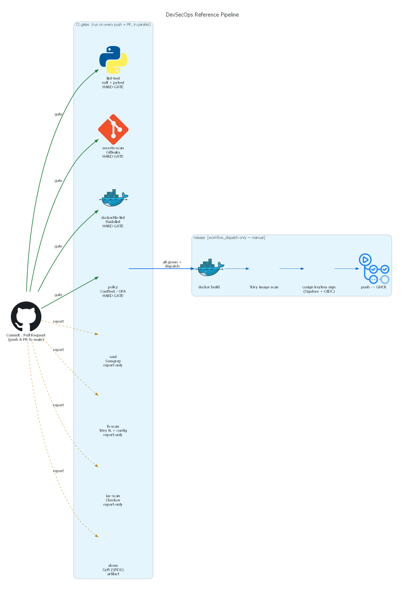
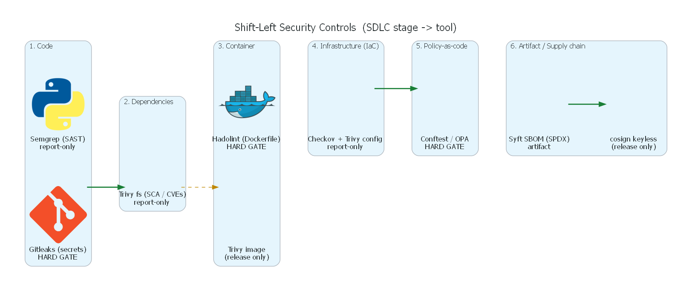
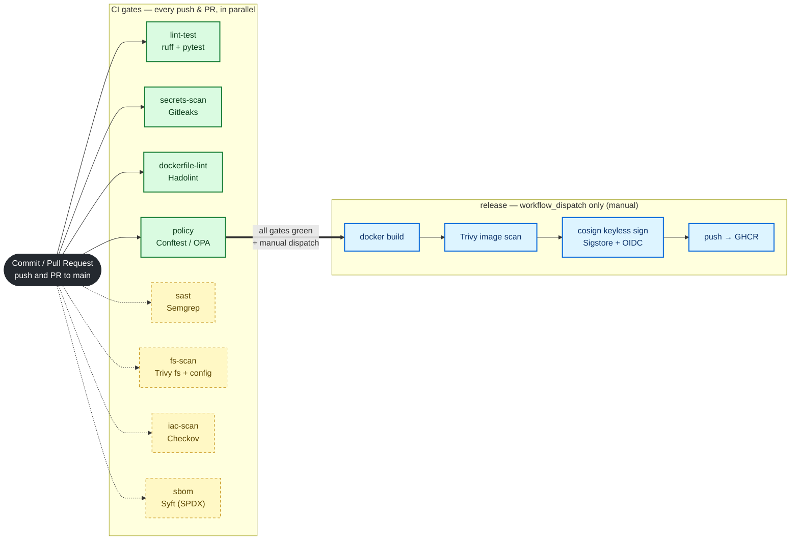
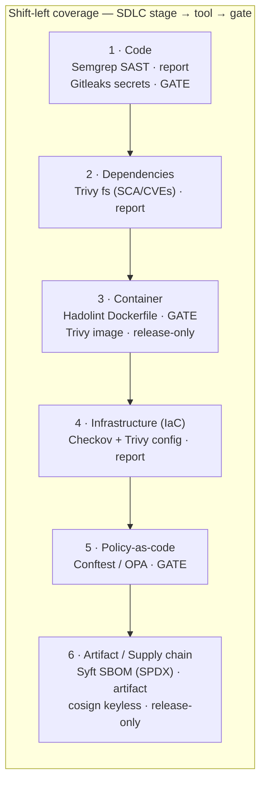
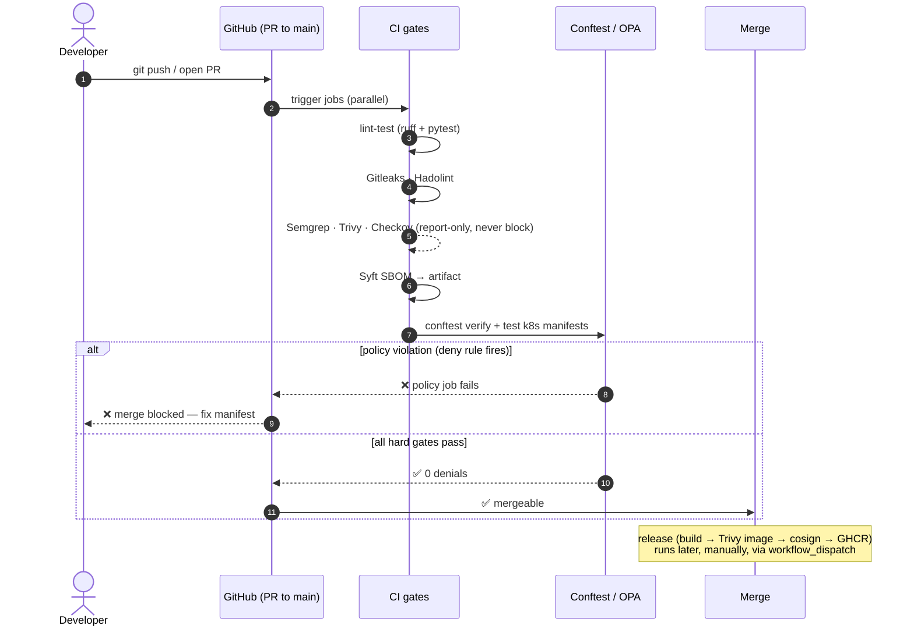

# Architecture Deep Dive

Reference **shift-left DevSecOps** pipeline for a small-but-real FastAPI service.
Every scan/lint/test gate runs on each push and PR using free/OSS actions, so the
workflow stays **green on a public fork with no secrets configured**. The image
build + keyless signing chain is isolated in a manual, on-demand `release` job.

> Author: Md Irshad — Senior Cloud & AI Platform Engineer
> Source of truth: [`.github/workflows/devsecops.yml`](../.github/workflows/devsecops.yml)

Rendered diagrams (diagrams-as-code, mingrammer `diagrams`):





Regenerate with `make diagrams` (needs Graphviz `dot`).

---

## 1. Pipeline flow

Eight independent CI jobs run in parallel on every `push` and `pull_request` to
`main`. Solid = **hard gate** (fails the build); dashed = **report-only**
(audit / soft-fail, prints findings but never blocks). The `release` job runs
**only** via `workflow_dispatch` (manual "Run workflow").



**Hard gates:** `lint-test`, `secrets-scan` (Gitleaks), `dockerfile-lint`
(Hadolint), `policy` (Conftest/OPA).
**Report-only:** `sast` (Semgrep audit), `fs-scan` (Trivy `exit-code: 0`),
`iac-scan` (Checkov `soft_fail: true`), `sbom` (artifact only).

---

## 2. Security-controls matrix

Each SDLC stage maps to the OSS tool that covers it and whether it blocks.



| SDLC stage | Job | Tool (OSS) | What it catches | Gate / Report |
|------------|-----|------------|-----------------|---------------|
| Code — secrets | `secrets-scan` | Gitleaks | Hardcoded credentials in tree/history | **HARD GATE** |
| Code — SAST | `sast` | Semgrep (`p/ci`,`p/python`,`p/security-audit`) | Insecure code patterns | Report-only |
| Dependencies (SCA) | `fs-scan` | Trivy `fs` (vuln,secret) | CVEs in pinned deps, leaked secrets | Report-only |
| Container — Dockerfile | `dockerfile-lint` | Hadolint | Dockerfile anti-patterns | **HARD GATE** |
| Container — image | `release` | Trivy image | CVEs in built image (before push) | Release-only |
| IaC misconfig | `fs-scan` / `iac-scan` | Trivy `config` + Checkov | Terraform / K8s / Dockerfile misconfig | Report-only |
| Policy-as-code | `policy` | Conftest / OPA | Org K8s policy (see below) | **HARD GATE** |
| Supply chain — SBOM | `sbom` | Syft (SPDX) | Software Bill of Materials | Artifact |
| Supply chain — signing | `release` | cosign (keyless) | Provenance via Sigstore + OIDC | Release-only |

---

## 3. PR through the gates (sequence)



---

## 4. Supply chain / release flow

The `release` job is guarded by `if: github.event_name == 'workflow_dispatch'`
and is the only place with elevated scope
(`packages: write`, `id-token: write`). Cosign uses **keyless** signing — the
GitHub OIDC token stands in for a private key, so no long-lived keys exist
anywhere in the repo.

```mermaid
flowchart LR
    D([workflow_dispatch<br/>manual "Run workflow"]):::t --> N{all 8 gates<br/>green?}
    N -- no --> X([release skipped]):::x
    N -- yes --> B["docker build<br/>(load, no push)"]:::s
    B --> V["Trivy image scan<br/>CRITICAL/HIGH"]:::s
    V --> PU["docker push<br/>→ GHCR :sha + :latest"]:::s
    PU --> SB["Syft SBOM (SPDX)<br/>from CI artifact"]:::a
    PU --> CO["cosign sign --yes<br/>IMAGE@DIGEST"]:::s
    CO --> R["OIDC token<br/>(id-token: write)"]:::o
    R --> TL["Sigstore Rekor<br/>transparency log"]:::o

    classDef t fill:#24292f,color:#fff,stroke:#24292f;
    classDef s fill:#ddf4ff,stroke:#0969da,stroke-width:2px,color:#0a3069;
    classDef a fill:#dafbe1,stroke:#1a7f37,color:#0b3d1a;
    classDef o fill:#fbefff,stroke:#8250df,color:#3b1666;
    classDef x fill:#ffebe9,stroke:#cf222e,color:#82071e;
```

---

## 5. Per-stage reference

| Job (workflow name) | File(s) exercised | Command / action | Fails build? |
|---------------------|-------------------|------------------|--------------|
| `lint-test` | `app/**` | `ruff check .` + `pytest -q` | Yes |
| `secrets-scan` | whole tree + history | `gitleaks/gitleaks-action@v2` | Yes |
| `sast` | `app/**` | `semgrep scan --config p/ci p/python p/security-audit` | No (audit) |
| `dockerfile-lint` | `app/Dockerfile` | `hadolint/hadolint-action` (`failure-threshold: warning`) | Yes |
| `fs-scan` | `.` | `trivy fs` + `trivy config` (`exit-code: 0`) | No (report) |
| `iac-scan` | `terraform/`, `k8s/`, Dockerfile | `checkov-action` (`soft_fail: true`) | No (report) |
| `policy` | `k8s/deployment.yaml`, `policy/**` | `conftest verify` + `conftest test` | Yes |
| `sbom` | `app/` | `anchore/sbom-action` → `sbom.spdx.json` | No (artifact) |
| `release` | `app/Dockerfile` | build → Trivy image → push GHCR → cosign | Manual only |

### OPA policy gates (`policy/deployment.rego`)

The hard policy gate denies a K8s Deployment that:

1. uses a mutable `:latest` (or untagged) image,
2. does not run as non-root (`runAsNonRoot: true`),
3. allows privilege escalation (`allowPrivilegeEscalation: false` required),
4. lacks a read-only root filesystem (`readOnlyRootFilesystem: true`),
5. omits CPU **or** memory limits.

`k8s/deployment.yaml` and `policy/conftest/inputs/deployment-pass.yaml` satisfy
all five and produce **0 denials**. The intentionally insecure
`policy/conftest/inputs/deployment-fail.yaml` is a **negative-test fixture** — it
is asserted against by the rego unit tests (`conftest verify`) but is **not** fed
to the enforcing `conftest test` step, so it never turns CI red.
